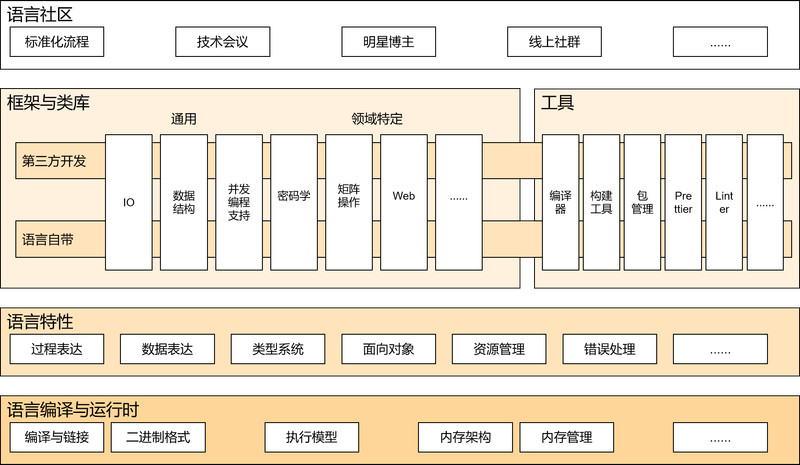
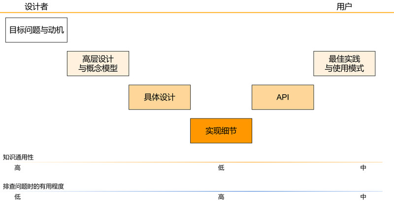
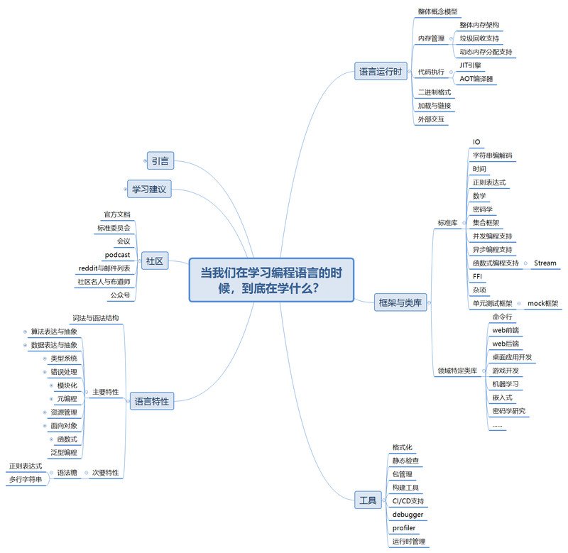

> 语言与工具常变，模式与解法长青，问题永恒
> 
> —— johnbanq

## 引言：百花齐放的编程语言，麻木的程序员

啊，编程语言！程序员的斧头和锯子，给计算机下命令的鬼画符，引发圣战的导火索。我相信学习编程语言是绝大多数人入门计算机的起点。

就像现实世界中的语言一样，我们并没有一门统一的编程语言，而是有上百种大大小小的语言，其中少数几门被极其广泛地使用。不过与现实世界不同的是，编程语言迭代和发展的速度是普通语言难以望其项背的。几乎每年都有新的编程语言诞生，有语言走向流行或消亡。现有的编程语言也在（至少试着）快速地发展，新增语言特性，更新标准库，废弃甚至删除旧的语言特性或库特性。

### 为什么我们要学习一门新的编程语言？

于是，我们看着场下一群新语言的布道师和教徒第101次宣布C++行将就木，Java反人类而且必须明天就从世界上消失，Python和Javascript都难当大任，只有他们信仰的某个新语言才是唯一的真理。

尽管他们当中不少人言辞激烈，义愤填膺，不过他们宣传的新语言确实有些好处。那我们该咋办呢？首先，我们不可能全部都学，死抱着一门语言不放也不是个好主意，哪怕这门语言非常底层和稳定（例如ANSI C）。要回答这个问题，我们不妨先思考一下：我们为什么需要学一门新语言呢？

> 猜想：
> 
> 我们一般只会出于两个理由去学习新的语言:
>
> * 解决新的问题或更好地解决现有的问题
>
> * 了解或使用新语言特性或范式
>

总所周知，我们不可能设计出一门可以在所有场景下适用，包含每个人都想要的语言特性，可以便利地解决所有问题的编程语言——毕竟越通用，越难用。上一个打算这么搞的语言是C++，看看它变成啥样了（叹气）！如果我们打算让所有人满意，我们就很可能会无节制地往语言里面倒语言特性，进而得到一锅粘稠的特性汤。

特性汤是一个彻头彻尾的坏主意：
* 首先，这锅汤里面的特性很容易相互作用，产生大量的边界情况。
* 其次，丰富的语言特性会使得同一段算法有许多种可能的写法，这将会极大地增加程序员的学习成本和编写代码时的心智负担。
* 另外，大量重叠的语言特性也很容易导致语言的方言化，进而分化语言社区。
    * 试想一下，如果一个库选择使用错误类型做错误处理，而另一个打算使用异常，第三个又在用错误码，那同时使用这三个库将会是多么有ma趣fan的一件事情！

各个领域一般都对具体的编程语言有所偏好。一门编程语言之所以能够流行，一个很重要的因素就是它在某个领域取得了重要甚至主导的地位，或者是某个重要平台的钦点语言。我们搞嵌入式和底层系统会用C/C++/Rust，写云原生基础设施会用golang，写Web后端服务会用Java，Web前端会用Javascript，搞机器学习与人工智能会用Python。

之所以这么选择，不是因为其它语言不行（大家都是图灵完备的，强行写都能做），而是因为这个领域的大量从业者出于各种原因最终集体选择了这门语言（可能是因为它拥有足够多的库和框架，解决这个问题的体验可以接受，同时赶上了生态空窗期，再配上商业公司背书和充分的宣传）。这使得你在使用这门语言解决该领域问题的时候可以充分享受先前人积累下的框架和库，以及无数的博文，视频和参考方案。

这也是为什么人们会有一种C/C++社区出“底层大牛”，Java出“架构师”的感觉。前者可能天天和各种底层细节和段错误打交道，解决基础设施方面的问题；后者享受着近二十年来海量的框架，库和实践经验——当其它语言还在凑工具和框架的时候，Java Web开发就已经进入到了大兵团多兵种联合作战的时代，对各种规模的服务都有成熟的解决方案。没人拦着你用C/C++搞web后端（Rust倒是有希望），用Java搞云原生，用golang搞机器学习研究，但是天哪（后仰）。当然，这个选择也不是永恒的，一旦更好（一般而言要好十倍）的，可以解决新痛点的语言出现，而旧的语言无法解决新痛点之时，社区就可能会开始拾掇换语言的事情了。

学习一门编程语言也是了解语言特性或范式的好办法。虽然你也可以在Java社区或Javascript社区习得一些函数式编程的概念，但是真正学会必须得去学习一门真正的函数式编程语言（例如Haskell或Lisp）才行。你也许可以在Java/C++学习面向对象和MVC模式，但是如果需要追根溯源，可能就需要去见见Alan Kay的Smalltalk或者是把MVC搞成今天这个样子的Ruby和它著名的Rails框架。在习得一个特性或者语言范式后，即使你回到了先前的语言里去，你也可以采用某些间接的手段把你知道的特性或者范式打出来。C当然可以玩面向对象，Java当然可以玩函数式，只不过需要多一些间接，多一些语法噪音罢了。甚至到了未来这个语言引入了某个新特性，你也反手就可以把其它编程语言社区里实践这个特性的经验拿来用。

### 编程语言的共性

当你开始学第一门编程语言的时候，你可能会感觉非常吃力。而当你开始认识第三门，第四门风格相似的语言的时候，如果你比较聪明，或者坐下来反思过，就会发现其实编程语言是有共同点的。你去问任何一个为了写项目而被迫学半打语言的人，他们基本都会和你有相同的感觉。王垠也有一篇文章赞同这一点：[《如何掌握所有程序语言》](http://www.yinwang.org/blog-cn/2017/07/06/master-pl)。

但是我们是工程师，不是哲学家。高屋建瓴的一句“编程语言都是相通的”，和“万物皆对象”一样，属于非常正确，很有启发，但是没有实际球用的见解。我们需要把具体的共性揪出来。

那么这么做有什么好处呢？

首先，如果你认识的语言特性够多，有一个具体一点的清单，那么就可以在时间紧凑的情况下强行以“填表”的方式上手一门语言。一门语言的类型系统如何？控制流怎么写？函数怎么定义？变量常量怎么定义？数据如何组织和抽象？错误处理和资源管理呢？闷头看例子吃下去，和自己学过的语言类比，就可以迅速上手开始写代码。而一旦遇到不懂的也知道如何搜索，去寻找等价的写法。

>
> 追问：我可以靠这招精通一门编程语言吗？
>
> 抱歉，不行。虽然语言特性也许很像，但是语法和实现细节，以及最佳实践会有所不同，而这些就是精通一门语言需要学会的。
> 
> 此外，很多编程语言都会有一些你不认识的语言特性。有时候它们就是这门语言的卖点，是与其它编程语言竞争的核心竞争力。你在学习新语言时很多时候是在和它们缠斗。
>

其次，这么搞可以让你跨语言复用使用语言特性的经验。C++的RAII和Rust的生命周期非常相似，那么C++关于析构函数的建议和要求没准对Rust的相应声明也起作用。如果一门语言支持传统面向对象，那么设计模式那一套也可以开箱即用。如果你在Javascript社区知道手写回调是个非常非常非常糟糕的主意，你在Java写异步代码的时候就会有意识地去找Promise的替代品。

另外，你也可以用这个清单去思考各个语言在解决不同问题上的权衡和选择。有的语言大道至简，立志成为所有程序员能力的最大公约数，有的语言打算让自己有令人咋舌的表达能力。如果我们看见某个语言有某个东西而另一个语言没有，那么就是一次移植和参与到标准化进程的机会。Java社区大热的反应式编程库RxJava其实是.NET中Rx.NET的延伸，async/await貌似最早也是.NET弄出来的。

## 正文：编程语言的知识结构




我猜想，我们关于某个编程语言的知识可以大致归入上图所示的版图中，分为四个大类：
* 语言社区
* 框架，库以及工具
* 语言特性
* 语言编译与运行时

我接下来将会以语言特性=>框架与库=>运行时=>语言社区这个顺序进行介绍。我认为前三项是我们在上手一门语言时的常见学习和了解顺序，而第四点一般会被忽略，这会比简单的上下顺序好一些。

### 板块：语言特性

语言特性就是你学习一门语言时最先见到，最先开始学习的那些东西，例如如何声明变量，编写函数，声明结构体和类，定义模块等等等等。

一个语言特性可以进一步被分为语法和语义：
* 语法即为在编程语言里描述这个东西的写法
* 语义即为我们要描述的东西本身

例如，同样是定义一个结构体Foo，含有bar和paz两个成员：

C/C++里是这么写的：
```c++
struct Foo {
    int64_t bar;
    bool paz;
};
```

Kotlin里长这样：
```kotlin
data class Foo(
    var bar: Long,
    var paz: Boolean
)
```

Rust里却长这样：
```rust
struct Foo {
    bar: i64,
    paz: bool,
}
```

尽管它们的语法不尽相同，但所希望描述的东西，即语义是基本一样的。

编程语言,究其核心可以理解为语言特性的集合。编程语言的设计者会出于某些核心价值观，便于解决某些问题或者仅仅是提升使用体验而选择一门语言的核心初始特性。之后可能会因为同样的原因，或应社区的要求往语言中加入语法特性。

### 板块：框架，库以及工具

要做东西，只了解语言特性是不够的。无论是写hello world时的println/printf，还是在现代语言中都有提供，解决日常问题时必不可少的数据结构与容器，都属于框架与库的范畴。此外，我们还有一系列的工具来帮助我们干检查代码库中的常见错误与反模式，自动化复杂项目的构建，依赖的下载安装与发布等费时费力或容易遗漏的事情，进而提升开发体验和效率。

#### 分类：官方与第三方

在学习编程语言时，你首先认识的就是随语言一并提供的库，框架与工具。随语言一并提供的库一般也会在语言标准中出现，所以一般也可以叫做标准库。

大多数现代编程语言都有相对完善的标准库，这一思路曰内置电池（Battery Included）。

内置电池有这些好处：
* 提高语言的学习体验，省去你找和安装三方库的时间
    * 如果没有完善的标准库，无论你打算做点啥实用的都要会依赖安装和包管理 :/ 
* 避免多个实现竞争同一个生态位的混乱
    * 试想一下，如果你想用的库A使用了Json库Json4j，但是你的代码库里用的Json库是JAwesome，那库A用起来就有点麻烦了。或者更糟糕的是，Json4j只能在windows下用，JAwesome只能在linux上用。~~C艹程序员的痛~~
* 补足语言早期社区不活跃而导致的生态缺失
    * 你会拿一门基础工具毛都没长齐的语言来干活吗 :/
 
但是内置电池也会让社区倾向于不去探索更好的解决方案——既然标准库都提供了，何苦再自己折腾呢？

标准库一般只会覆盖最基本和核心的功能，很多时候工作还需要其它人编写的库协助完成。标准负责的越少，语言早期就会越难过，但是社区能做的就越多，这就代表有更高的热度和更多的投机点。

#### 分类：多领域通用和领域特定

框架，库以及工具也可以大致分成跨领域通用的和领域特定的。

跨领域通用的就是那些很多场景都能用上的工具。例如IO，正则表达式，数据结构与容器等。

领域特定就是那些少数场景才有用的工具。例如Web框架，游戏开发框架，机器学习框架等。

如果你不写网站，那没有Web框架对你而言很可能无所谓。但是对一门现代语言而言，如果缺乏动态数组，哈希表等数据结构就几乎是无法容忍的。

注：这条通用和特定的线其实没有那么明确，仅供参考 :/

#### 附：框架与库的区别

顺带一提，库和框架的区别在于：
* 库更像是一套工具，对应用的整体结构基本没有约束。
* 框架更像是，呃，框架。它会要求（或者非常希望你）按某种方式组织你的应用。

一般来说，在解决适用区内的问题时，约束越强的工具往往开发效率越高，因为约束相当于让框架作者更多地了解你的应用，并给你提供更多的帮助。不过当然，一旦框架离开了它的适用区，就会熄火：你会发现开发的绝大多数时间并不是在写你要做的事情，而是在和框架斗争。

### 板块：语言编译与运行时

如果你希望深入理解甚至精通一门编程语言，那么你就必须了解自己的代码到底是怎么从源代码到跑起来的，整个进程的运行时行为大致是怎样的。

对于编译执行的语言而言，这里指的就是从源程序到结果二进制的编译链接管线（gcc/clang），以及结果二进制长啥样，是如何装载和启动的，运行期的内存镜像长什么样。

对于解释执行的语言而言，这里指的就是语言虚拟机（Java Hotspot，Javascript V8，CPython等）。

对语言运行时的深入理解可以帮助你排查错误，更好地和编译器与内存管理机制一起工作，而不是用想当然的优化去给自己和编译器找麻烦，以及解决大名鼎鼎的调优类问题。

### 板块：语言社区

上述的所有知识都是在关心语言的现在——简而言之就是语言现在有什么特性，如何使用，有什么生态，运行时如何。

而关注语言社区更像是关心一门语言的未来。通过参与到语言的社区中去，我们可以了解语言的发展方向，同时认识一些较为前沿的技术和方法论。

首先值得关注的是语言的标准化进程，阅读语言特性提案能让你知道为什么这个语言要加入这个语言特性，其它的备选方案是什么，为什么我们选择了这个，以及预期是如何实现的。这些“为什么”类型的知识可以有效地提升你对某一特性的理解，让你可以扬长避短，把它的真正优势打出来。至于例子，C++有Standard Proposal，Java有JEP，Python有PEP，Kotlin有KEEP，Rust有自己的RFC体系。

其次，一般来说主流语言或框架工具都会有自己的年度会议。你可以在会议上听语言标准委员会成员讨论新的语言特性及其设计动机，听框架工具的作者和布道师讨论框架的新特性与优势，或者知道一些有趣的开发技巧，学习别人的经验教训。如果你立志成为C++专家，就一定不要错过cppcon，在JVM上工作的人最好去JVM Language Summit转转，Spring全家桶的死忠粉一定要认识Spring One。凡此种种，不胜枚举。简要地浏览它们，选择感兴趣的讲师和话题深入挖掘，总会有帮助的。

最后，语言社区一般都会有一些值得关注的人，他们往往是长期博主，标准委员会成员或知名项目的长期贡献者。你可以从他们的演讲和博文中学到很多。你很难比Stuart Marks或Brian Goetz更懂Java，比Herb Sutter更懂C++，比Aleksey Shipilёv或RednaxelaFX更懂JVM——你的语言边角是别人的设计决策，你的底层原理是别人的业务逻辑，打不赢啊 :/

此外，一些讨论群和线上团体也是值得偶尔逛一逛的，你也可以通过它们看到一些有趣的东西。

### 现象：下沉路径

回到我们的全景图。当我们以这种切分方式去看待知识时，我们就会发现一些知识有着有趣的“发展路径”——

* 异步编程最早的做法就是回调，但是语言的使用者们（语言社区）经过不断的探索，发现回调套回调是一件极其操蛋的事情（回调地狱）。
* 为了解决回调地狱，我们（语言社区）提出了Promise，并把它做成了一个库供大家使用（第三方库）
* 语言标准委员会发现这个东西被广泛地到处使用，而且统一一下有助于异步库之间的互操作，于是就纳入了标准库（标准库）
* 为了进一步方便异步操作的编写，语言设计者们决定对语言稍加改进，让基于Promise的代码更好写——async/await（语言特性与语言运行时）

（我没详细调查过是不是这条路线，就当我口胡吧）

当然，当中有些阶段可能是被跳过的。但是整体会遵循一个发现问题——以第三方库或模式的形式提供解法——纳入标准库——进入语言特性集的一个顺序进行。这个过程可能是跨语言的（后来语言的标准库将先前语言的第三方库特性收编，或者往语言特性集合中加新特性以方便开发）

## 正文：细节之谷

我们在上文给出了编程语言知识的四大板块，其中除语言社区外（社区更像是知识的源流，而非要学习的知识），每个版块又有很多（真的很多！）的小块组成：
* 语言特性可能包括变量与常量，赋值，控制流与函数等等
* 框架与库可能包括密码学库，或者容器库等等
* 语言运行时可能包括垃圾回收，即时编译器等等

我们关于一个小块的知识又可以大致分成下图所示的六类，按从设计者端到用户端的顺序从左到右排布。如果再将知识的细节含量作为深度的话，我们就得到了一个~~Nike~~钩形：我们不妨把它叫做“细节之谷”。细节越多越具体，越能帮助我们在使用时做性能优化和故障排查。细节越少越通用，我们可以跨多个工具甚至跨语言使用这些知识。



其实这个模型来源于我对一些框架和库的观察，所以我就用Java社区大名鼎鼎的Spring（Spring Core Framework / Core Technologies）举例好了。这个分类应该也同样对语言特性与运行时适用：
* 目标问题与动机是我们设计这一特性或者库所要解决的核心问题。
    * 对Spring而言，可能需要解决的问题就是大规模程序的组织和解耦合
* 高层设计与概念模型则是我们解决这一问题的高层解法：例如选用什么方案与模式，大致将问题划分成哪几块进行解决。
    * Spring决定采用基于面向对象的组件化开发：把整个应用拆成一堆组件，并用依赖注入将依赖显式化，动态化。
* 具体设计这一块相对模糊，大概是低于高层设计而又高于源码细节的那些设计决策，但是还没有过多的具体实现细节，例如边界情况，特例和与其它特性的相互作用，具体如何安排代码等等。
    * 对Spring而言，可能是某个特性或某一块的大致实现方案（如何解决循环依赖，如何处理请求等等）
* 实现细节就是源码本身了，我们需要处理上面提到的各种细节问题。
* API则是设计者给用户提供的公开接口。那些写在教程，样例和参考手册里的东西。
* 最佳实践和使用模式则是如何有效地使用这些API或特性来完成任务，或者这个特性有什么坑，如何绕开的知识。

同样是解耦合。你可以用OOP/依赖注入来解决，也可以用依赖查找来解决。见鬼，甚至你能用Free Monad和Algebraic Effects来对付。

而同样是依赖注入，Guice，Spring，Dagger，Angular DI的具体设计和实现都会有这样那样的不同。

然而它们都是依赖注入工具，所以它们的使用方法，模式和反模式都是一样的。

这就是为什么细节之谷不是细节之坡，也不对称，而是呈钩型的原因。从动机到源码越来越具体，但是API能相对独立于具体实现，使用模式方面的知识也不完全紧耦合于API。

## 总结

简单总结一下吧：
* 程序语言是大多数人入门计算机的起点，我们一般会出于拥有解决某个问题的能力，或者是了解或使用语言特性的原因而学习一门语言。
* 我们在学习语言的时候，往往并不只是在学习语言本身。我们同时也在学习语言的运行时，学习框架，库与工具，也许还会参与到语言的社区中去。
* 对于每个语言特性/语言运行时的功能/框架和库而言，我们学习的是该工具要解决的问题，高层概念模型，具体设计，API，以及使用方式与最佳实践。同时，为了增加特性，修bug，或者面试（叹气），我们需要了解和阅读实现源码。

## 学习建议：一主多从，重视原理

那么我们要怎么学习这么一堆玩意儿呢？

我认为每个程序员都要有自己的“主战语言”。你熟知这门语言的语言特性，最佳实践和坑；对运行时颇有研究；对常见框架库和工具都熟悉，还读过当中一两样常用东西的源码，没准还给它们修过bug，或者自己造过轮子；会有意识地了解这门语言相关的新闻和新知识。

在主战语言之外，你应该试图了解多门在范式/设计理念/目标问题方面尽可能正交的语言。它们能扩展你的认知。正所谓见到才能想到，想到才能做到。没见过Promise你就得和Promise的作者一样聪明，同样下过回调地狱才能想到这个抽象。你当然可以亲自下一遍然后想办法，但是直接认识答案会省事些。

对框架和工具而言，你应该至少知道它们在解决什么问题，顶层概念模型是什么。不然在能用到的时候都不知道有这个工具，那就尴尬了。对于常用的工具应当有意识地收集具体设计与最佳实践相关的知识。如果你希望彻底精通某个东西，就得去关注源码了。

此外，一般不建议上来直接跳到源码，因为那样你就是在用（如果你有的话）最多右边的知识攀爬左边的高坡，这个逆向推导的过程是非常痛苦的，而且很容易误解，导致读半天没读到重点。一般建议在解决右边之后，从左到右，逐步下降进入峡谷。此外，源码变的比你想象的要快：[这里是Java OpenJDK Hotspot VM的代码库](https://github.com/openjdk/jdk/tree/master/src/hotspot)，我去看的时候发现上次提交居然是19分钟前。关于源码具体细节的知识可能容易过期，实现思路和算法或许要保值得多。

还有，对于相关专业的学生而言，上来就吃具体语言的知识可能有点不划算——你有四年的时光，砍掉找工作实习的年头最少也有两年。多花时间去对付基础科目吧：学点C；与其背优化Pass，不妨去看看龙书鲸书；与其在JVM GC算法的具体实现里迷路，不妨去刷The Garbage Collection Handbook。它们就是细节之谷的最左端，在学它们的过程中适当结合具体语言的实现可以极大地强化你对这些知识的认识。

最后，不要浪费太多时间在语言社区打转：认识不是学习，知道不是学会 :/

## 碎碎念

其实本文最早是一个系列的开头：我当时想讲详细一点，于是试着列了一下我认识的东西。发现要真这么搞我看我能鸽到退休——



我对写书没有兴趣，谢谢 :/

本文所提出的分类仅仅是我个人的经验之谈。这些分类并不是最好的，甚至不是正交完备的。语言特性——标准库——语言运行时很多时候是三位一体的：例如协程就需要运行时的特等支持，标准库提供的类型予以表达，有时候还要语言声明某个函数可以被中断（async或suspend）。 但是我认为我们至少应该有这样的分类意识，便于我们探索和复用知识。

如果你对编程语言的范式与语义感兴趣，听说《冒号课堂》和《Concepts, Techniques, and Models of Computer Programming》都很不错。

最后，为了让本文的质量尚可卒读，本文作者在编写与校审过程中掉了亿根头发，鸽了∞次，经历了ℵ₀ 次焦虑发作，谨以此段聊作吊唁 ;)